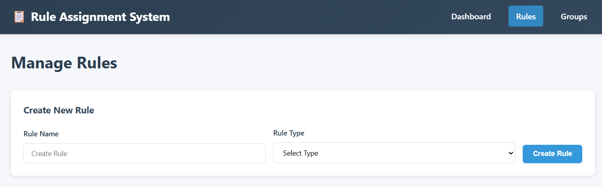
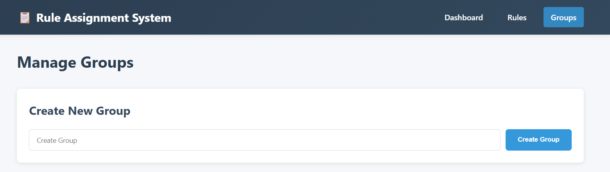
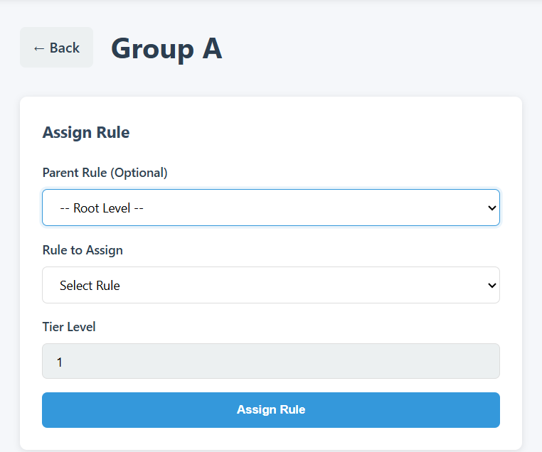
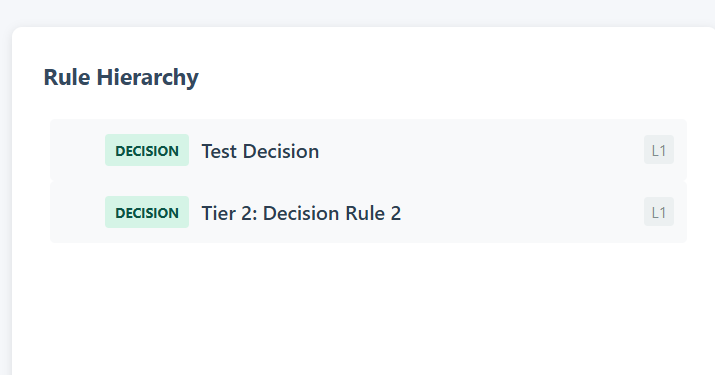
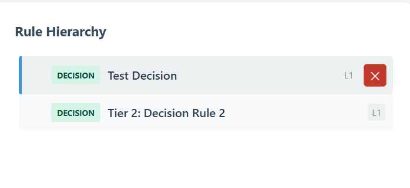

# Rule Assignment System - Solution Report

**Project**: Rule Assignment System for Hierarchical Rule Management  
**Date**: 09 April 2026

---

## Table of Contents
1. [Executive Summary](#executive-summary)
2. [Problem Statement](#problem-statement)
3. [Solution Architecture](#solution-architecture)
4. [Database Design](#database-design)
5. [Backend Implementation](#backend-implementation)
6. [Frontend Implementation](#frontend-implementation)
7. [API Endpoints Documentation](#api-endpoints-documentation)
8. [Key Features & Constraint Implementation](#key-features--constraint-implementation)
9. [Technology Stack & Versions](#technology-stack--versions)
10. [Installation & Setup Guide](#installation--setup-guide)
11. [Usage Guide](#usage-guide)

## Executive Summary

The **Rule Assignment System** is a comprehensive web-based application designed to manage complex hierarchical rule structures. It provides an intuitive interface for creating, managing, and visualizing rule hierarchies with built-in constraint enforcement, business logic validation, and a responsive Vue.js frontend.

---

## Problem Statement

### Overview
Organizations require a system to manage complex hierarchical rule structures where:
- Rules are organized into logical groups
- Rules follow a Condition-Decision branching model
- Hierarchies are limited to maximum 3 tiers
- Business constraints must be enforced at all levels

### Key Requirements

#### Rule Model
- **Rule ID**: Unique identifier
- **Rule Name**: Descriptive name (must be unique)
- **Rule Type**: Either "Condition" or "Decision"

#### Rule Types & Constraints
- **Condition Rule**: 
  - Represents a conditional branch
  - Must have at least one child rule
  - Cannot be a leaf node in the hierarchy
  
- **Decision Rule**: 
  - Represents an end decision or action
  - Cannot have any child rules
  - Must be a leaf node in the hierarchy

#### Hierarchy Constraints
- **Maximum 3 Tiers**: Hierarchies cannot exceed 3 levels
- **Parent-Child Relationships**: Rules structured in parent-child relationships
- **No Duplicate Rules Under Same Parent**: Rules can be reused across tiers but not under the same parent node
- **Group Organization**: Multiple rules can exist in each tier within a group

#### Group Model
- **Group ID**: Unique identifier
- **Group Name**: Descriptive name (must be unique)
- **Contains Rules**: Multiple rules organized in a hierarchy

### Business Rules to Implement
1. Condition rules MUST have at least one child before save
2. Decision rules CANNOT have children
3. Maximum of 3 tiers in any hierarchy
4. Rules cannot be duplicated under the same parent
5. Rules can be reused across different parent nodes
6. Each tier must maintain order integrity

---

## Solution Architecture

### High-Level Architecture

```
┌─────────────────────────────────────────────────────────────┐
│                    Web Browser                              │
│                  (Vue.js SPA Frontend)                       │
└────────────────────────┬────────────────────────────────────┘
                         │ AJAX/HTTP API Calls
                         ▼
┌─────────────────────────────────────────────────────────────┐
│              API Layer (api.php)                             │
│  - Request routing & validation                              │
│  - Response formatting & error handling                      │
│  - CORS headers configuration                                │
└────────────────────────┬────────────────────────────────────┘
                         │
         ┌───────────────┴───────────────┐
         ▼                               ▼
┌──────────────────────────┐    ┌────────────────────┐
│   Model Layer            │    │  Validator Layer   │
│  - Rule.php              │    │  - Validator.php   │
│  - Group.php             │    │                    │
│  - Assignment.php        │    │  Business Logic:   │
│                          │    │  - Hierarchy       │
│  Business Methods:       │    │  - Type Checking   │
│  - CRUD operations       │    │  - Constraint      │
│  - Relationships         │    │    Validation      │
│  - Hierarchies           │    │                    │
└────────────┬─────────────┘    └────────────────────┘
             │
             ▼
┌─────────────────────────────────────────────────────────────┐
│         Database Layer (db-context.php)                      │
│  - Connection management                                     │
│  - Query execution                  │
│  - Data persistence & retrieval                              │
└────────────────────────┬────────────────────────────────────┘
                         │
                         ▼
                ┌─────────────────────┐
                │   MySQL Database    │
                │ - rules table        │
                │ - groups table       │
                │ - assignments table  │
                └─────────────────────┘
```

### Design Patterns Used

1. **MVC Pattern**: Model-View-Controller separation of concerns
2. **DAO Pattern**: Data Access Object for database operations
3. **Validator Pattern**: Separate validation logic
4. **RESTful API Design**: Standard HTTP methods and status codes
5. **Singleton Dependencies**: Global connection management
6. **Builder Pattern**: Hierarchical data construction

---

## Database Design

### Schema Overview

The database consists of 3 main tables with appropriate relationships and constraints:

#### 1. **rules** Table
Stores all rule definitions with their types.

**Columns**:
- `id`: Primary key, auto-incremented
- `name`: Unique rule name
- `type`: Either "Condition" or "Decision"
- `created_date`: Timestamp of rule creation

**Constraints**:
- UNIQUE on name (prevents duplicate rule names)
- NOT NULL on name and type (mandatory fields)

---

#### 2. **groups** Table
Stores all group definitions.

**Columns**:
- `id`: Primary key, auto-incremented
- `name`: Unique group name
- `created_date`: Timestamp of group creation

**Constraints**:
- UNIQUE on name (prevents duplicate group names)
- NOT NULL on name (mandatory field)

---

#### 3. **assignments** Table
Stores the hierarchical relationships between rules and groups.

**Columns**:
- `id`: Primary key, auto-incremented
- `group_id`: Foreign key to groups table
- `rule_id`: Foreign key to rules table
- `parent_id`: Self-referencing foreign key for hierarchical relationships
- `level`: Tier level in hierarchy (1, 2, or 3)
- `order_num`: Order of rule within its tier
- `created_date`: Timestamp of assignment creation

**Relationships**:
- `group_id` → `groups.id`: Many assignments per group
- `rule_id` → `rules.id`: Many assignments per rule
- `parent_id` → `assignments.id`: Self-referencing for parent-child relationships

Please find the Sql Schema script for migration scripts [here](./backend/database/rules-assignment-schema.sql)

---

### Entity Relationship Diagram (ERD)

Please find the ERD document for more details [here](./backend/database/erd.md)

---

## Backend Implementation

### Directory Structure

```
backend/
├── config.php                    # Configuration & constants
├── api.php                       # Main API router
├── src/
│   ├── Database/
│   │   └── db-context.php        # Database connection & helper functions
│   ├── Models/
│   │   ├── Rule.php              # Rule model class
│   │   ├── Group.php             # Group model class
│   │   └── Assignment.php        # Assignment model class
│   └── Validators/
│       └── Validator.php         # Business logic validation
└── database/
    └── rules-assignment-schema.sql  # SQL schema
```

---

### Configuration (config.php)

**Key Constants**:
- `MAX_TIERS`: Limits hierarchy to 3 levels (THis is used to handle the max tier hierarchical level for our rules assignment, if we need we can reduce/increase the level of tiers.)
- `MIN_CHILDREN_FOR_CONDITION`: Requires Condition rules to have children
- CORS headers enable Vue.js frontend running on port 3000

---

### Database Layer (db-context.php)

**Purpose**: Manages database connections and provides query helper functions.

**Key Functions**:

1. **query($sql, $params)**: Execute prepared statement
2. **getOne($sql, $params)**: Fetch single row
3. **getAll($sql, $params)**: Fetch all matching rows
4. **insert($table, $data)**: Insert new record
5. **update($table, $data, $where, $whereParams)**: Update record
6. **delete($table, $where, $whereParams)**: Delete record

---

### Model Layer

#### Rule.php

**Responsibilities**: Managing rule entities and database operations.

**Constants**:
```php
const TYPE_CONDITION = 'Condition';
const TYPE_DECISION = 'Decision';
```

**Validation Rules**:
- Name cannot be empty
- Name cannot exceed 255 characters
- Name must be unique in database
- Type must be either "Condition" or "Decision"

---

#### Group.php

**Responsibilities**: Managing group entities and hierarchical queries.

---

#### Assignment.php

**Responsibilities**: Managing rule-group hierarchy relationships.

**Cascade Deletion**:
- Automatically deletes all child assignments
- Maintains referential integrity

---

### Validator Layer (Validator.php)

**Purpose**: Enforces business logic constraints and hierarchical rules.

---

### API Layer (api.php)

**Purpose**: RESTful API endpoint router with request handling and response formatting.

**Architecture**:
- Action-based routing via GET parameter: `?action=get-rules`
- JSON request/response bodies
- Proper HTTP status codes
- Exception handling with 500 errors

---

## API Endpoints Documentation

### Base URL
```
http://localhost:8000/api.php
```

---

### Rules Endpoints

#### 1. Get All Rules
```
GET /api.php?action=get-rules
```
---

#### 2. Create Rule
```
POST /api.php?action=create-rule

---

#### 3. Get Rules by Type
```
GET /api.php?action=get-rules-by-type&type=Condition

---

### Groups Endpoints

#### 1. Get All Groups
```
GET /api.php?action=get-groups
```
---

#### 2. Create Group
```
POST /api.php?action=create-group

---

#### 3. Get Group Details
```
GET /api.php?action=get-group&id=1

---

## Key Features & Constraint Implementation

### 1. Rule Type Enforcement

**Condition Rules**:
- Can have child rules
- Must have at least one child before hierarchy is valid
- Validated in `validateGroupHierarchy()` method

**Decision Rules**:
- Cannot have child rules
- Must be leaf nodes
- Server prevents child assignment attempts

---

### 2. Hierarchy Tier Constraint

**Maximum 3 Tiers**:
- Level 1: Root assignments (no parent)
- Level 2: Children of tier 1 rules
- Level 3: Grandchildren (deepest level allowed)

**Enforcement**:
- API validates `level` parameter ≤ 3
- Database schema allows level 1-3
- Frontend UI prevents tier 4 selections

---

### 3. Duplicate Prevention

**Rule**: Rules cannot be duplicated under the same parent node.

---

### 4. Rule Reusability

**Feature**: Same rule can be assigned to multiple groups and parents.

**Example**:
```
Group A:
  ├── Rule 1 (Condition) [parent: null]
  └── Rule 2 (Decision) [parent: Rule 1]

Group B:
  ├── Rule 1 (Condition) [parent: null]  ← Same rule, different context
  ├── Rule 3 (Decision) [parent: Rule 1]
  └── Rule 4 (Decision) [parent: Rule 1]
```

---

## Technology Stack & Versions

| Technology | Version | Purpose |
|-----------|---------|---------|
| **PHP** | 8.0+ | Server-side language (OOP) |
| **MySQL** | 8.0+ | Relational database |
| **Vue.js** | 3.3.0+ | Progressive UI framework |
| **Vue Router** | 4.2.0+ | Client-side routing |
| **Pinia** | 2.1.0+ | State management |
| **Axios** | 1.6.0+ | HTTP client |
| **Vite** | 4.0.0+ | Build tool & dev server |

### Development Environment

| Tool | Purpose |
|------|---------|
| **XAMPP 8.2** | Apache, PHP, MySQL bundle |
| **Node.js** | JavaScript runtime for frontend tooling |
| **npm** | Package manager |
| **VS Code** | Code editor |

---

## Installation & Setup Guide

### Prerequisites
- PHP 8.0 or higher
- MySQL 8.0 or higher
- Node.js 14+ and npm
- Apache web server (provided by XAMPP)

### Step 1: Setup Backend Database

1. Start XAMPP (Apache + MySQL)
2. Access phpMyAdmin at `http://localhost/phpmyadmin/`
3. Execute the SQL schema script:

```bash
cd backend/database
mysql -u root < rules-assignment-schema.sql
```
---

### Step 2: Setup Frontend

1. Navigate to frontend directory:
```bash
cd frontend
```

2. Install dependencies:
```bash
npm install
```

3. Start development server:
```bash
npm run dev
```

The frontend will be available at `http://localhost:3000`

---

### Step 3: Test API Connection

1. Verify API is accessible:
```bash
curl "http://localhost:8000/api.php?action=get-rules"
```
---

## Usage Guide

### Creating Rules



### Creating Groups



### Assigning Rules to Groups



### Viewing Hierarchy



### Removing Assignments



## Testing & Validation

### Unit Test File (test-api.php)

Please find the unit test file for test cases [here](./backend/tests/test-api.php)
