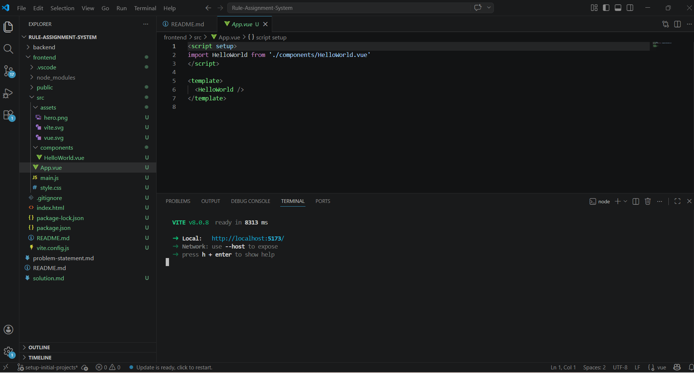
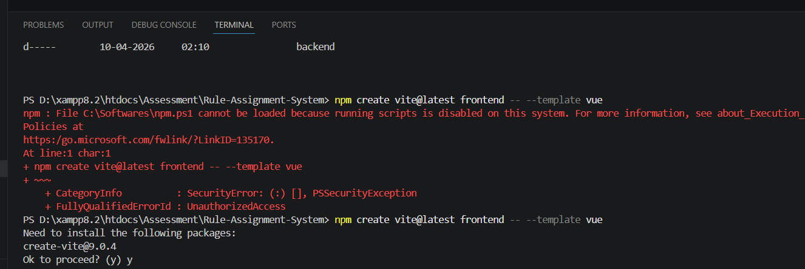
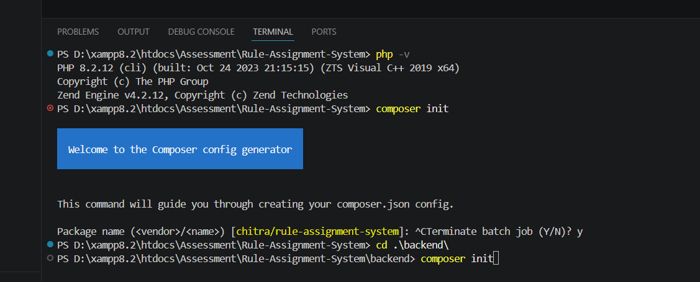
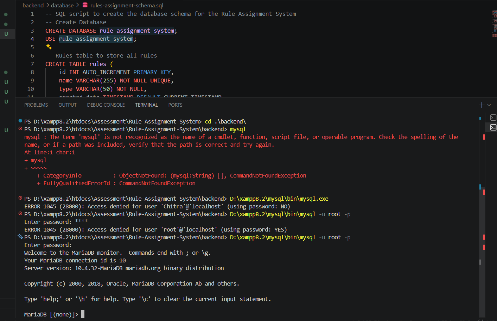
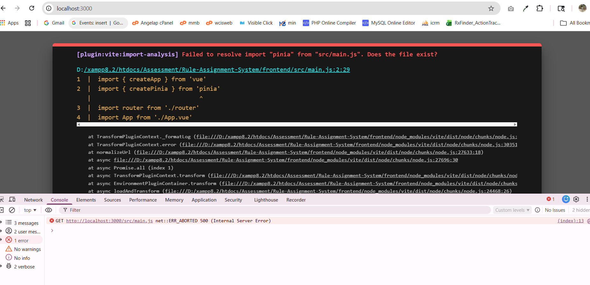
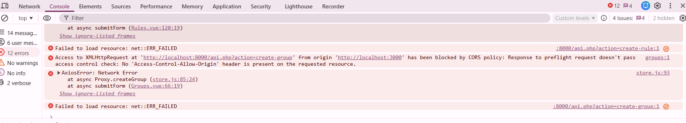

## Screenshots

### issues

 // No need to use composer here as we dont need to install any additional dependency.

## References
- https://vuejs.org/guide/quick-start
- https://getcomposer.org/doc/